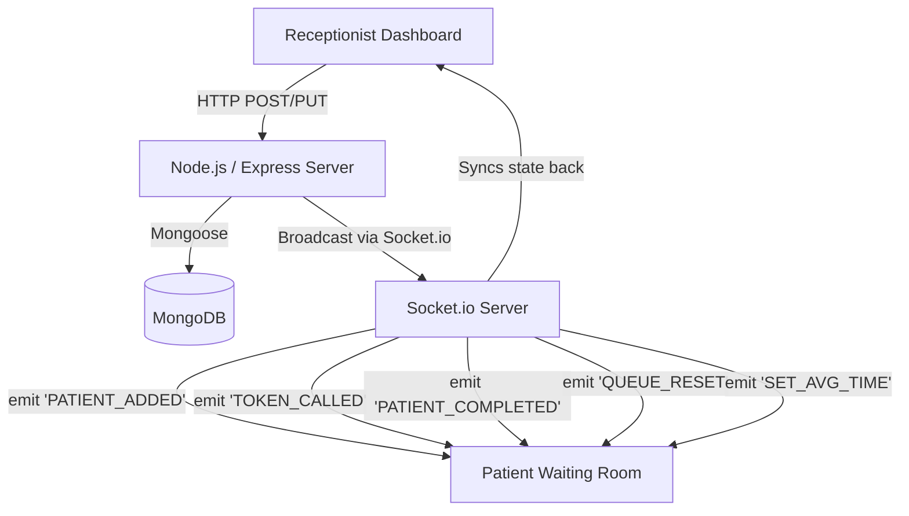

# Queue Cure - MERN Stack Real-Time Queue Management System

A production-ready real-time patient queue management system designed for modern clinics and hospitals. Receptionists can easily add patients and manage the queue, while patients can view live updates on a beautiful waiting room display.

## Features

- **Real-Time Synchronization:** The entire application syncs instantaneously across all devices without needing a refresh using Socket.io.
- **Receptionist Dashboard:** Comprehensive view of the entire queue, including waiting and completed patients.
- **Dynamic Estimated Wait Time:** Wait times are dynamically calculated based on the average consultation time and number of patients waiting.
- **Waiting Room Display:** A gorgeous, animated TV display board UI that shows the current token being served and patients up next.
- **Settings Management:** Adjust the average consultation time instantly to re-calculate wait estimations.

## Tech Stack

### Frontend
- **Framework:** React.js (Vite)
- **Styling:** Tailwind CSS, Framer Motion for beautiful animations
- **Routing:** React Router v6
- **Data Fetching:** Axios
- **Real-time:** Socket.io Client
- **Icons & Toast:** Lucide React, React Hot Toast

### Backend
- **Framework:** Node.js with Express.js
- **Database:** MongoDB (with Mongoose ODM)
- **Real-time:** Socket.io
- **Utilities:** CORS, dotenv

## Socket Architecture



## Setup Instructions

### Prerequisites
- Node.js installed on your machine
- MongoDB Atlas account (or Local MongoDB)

### Environment Variables

**Backend (`server/.env`)**
```env
PORT=5000
MONGO_URI=mongodb+srv://<username>:<password>@cluster.mongodb.net/queue-cure
FRONTEND_URL=http://localhost:5173
```

**Frontend (`client/.env`)**
```env
VITE_BACKEND_URL=http://localhost:5000
```

### Installation

1. **Clone & Setup Backend**
```bash
cd server
npm install
npm run start # or npm run dev for nodemon
```

2. **Setup Frontend**
```bash
cd client
npm install
npm run dev
```

## Deployment Guide

- **Database:** Setup a MongoDB Atlas Cluster and get your connection string.
- **Backend (Render):**
  - Create a new Web Service on Render, link your GitHub repository.
  - Set root directory to `server`.
  - Add Environment Variables (`PORT`, `MONGO_URI`, `FRONTEND_URL`).
  - Build command: `npm install`
  - Start command: `node index.js`
- **Frontend (Vercel):**
  - Create a new project on Vercel, link the same repo.
  - Framework Preset: Vite
  - Root directory: `client`
  - Add Environment Variable: `VITE_BACKEND_URL` pointing to the Render backend URL.
  - Deploy!

---
*Built as a Senior Full Stack Engineer project.*
